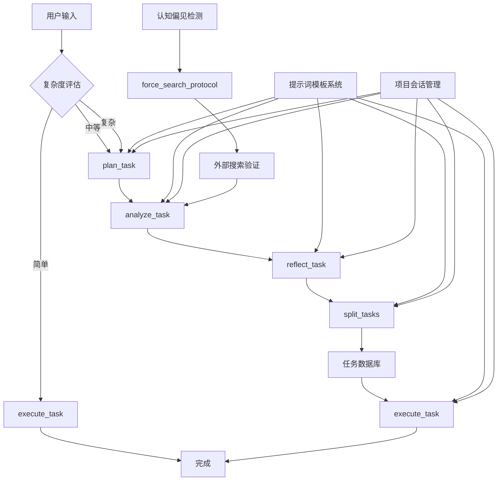

# MCP Shrimp Task Manager 工具调用流程深度分析

## 1. 工具注册与调用机制分析

### 1.1 MCP 协议层面的工具注册

基于 `src/index.ts` 的分析，MCP Shrimp Task Manager 采用标准的 MCP 协议实现：

```typescript
// 工具注册机制
server.setRequestHandler(ListToolsRequestSchema, async () => {
  return {
    tools: [
      {
        name: "plan_task",
        description: await loadPromptFromTemplate("toolsDescription/planTask.md"),
        inputSchema: zodToJsonSchema(planTaskSchema),
      },
      // ... 其他工具
    ],
  };
});

// 工具调用处理
server.setRequestHandler(CallToolRequestSchema, async (request: CallToolRequest) => {
  // Zod 验证 + 函数调用
  parsedArgs = await planTaskSchema.safeParseAsync(request.params.arguments);
  return await planTask(parsedArgs.data);
});
```

**关键特征：**
- ✅ **严格类型验证**：每个工具都有对应的 Zod Schema 进行参数验证
- ✅ **动态描述加载**：工具描述通过模板系统动态生成，支持多语言
- ✅ **错误处理机制**：完善的参数验证和错误信息返回
- ✅ **MCP 协议兼容**：完全符合 MCP 标准，AI 可以正确调用

## 2. 工具调用路径分析

### 2.1 三种调用路径

根据 `aiCallPathGuide.md` 的设计，系统支持三种调用路径：

#### 🚀 快速路径 (Fast Path)
```
用户需求 → execute_task → 完成
```
- **适用场景**：简单、明确的任务
- **复杂度指标**：描述 < 500 字符，0-1 依赖，单文件修改
- **AI 调用特点**：直接调用，无需中间步骤

#### 📋 标准路径 (Standard Path)  
```
用户需求 → plan_task → execute_task → 完成
```
- **适用场景**：中等复杂度任务
- **复杂度指标**：描述 500-1000 字符，2-4 依赖，多文件修改
- **AI 调用特点**：先规划后执行，确保方向正确

#### 🔬 深度路径 (Deep Path)
```
用户需求 → plan_task → analyze_task → reflect_task → split_tasks → execute_task → 完成
```
- **适用场景**：高复杂度、高不确定性任务
- **复杂度指标**：描述 > 1000 字符，5+ 依赖，跨系统变更
- **AI 调用特点**：完整的分析-反思-拆分流程

### 2.2 工具间数据流转机制

#### 数据传递方式
1. **提示词传递**：通过生成的提示词在工具间传递上下文
2. **任务数据库**：通过 `taskModel.ts` 持久化任务状态和依赖关系
3. **项目会话**：通过 `projectSession.ts` 维护项目级别的上下文

#### 关键数据流
```
plan_task 输出 → analyze_task 输入 (summary + initialConcept)
analyze_task 输出 → reflect_task 输入 (analysis 结果)
reflect_task 输出 → split_tasks 输入 (优化后的分析)
split_tasks 输出 → 任务数据库 → execute_task 输入
```

## 3. 提示词模板系统分析

### 3.1 模板生成机制

基于 `src/prompts/generators/planTask.ts` 的分析：

```typescript
export async function getPlanTaskPrompt(params: PlanTaskPromptParams): Promise<string> {
  // 1. 处理现有任务引用
  if (params.existingTasksReference) {
    const allTasks = await getAllTasks();
    // 生成任务上下文
  }
  
  // 2. 加载模板组件
  const thoughtTemplate = process.env.ENABLE_THOUGHT_CHAIN !== "false" 
    ? await loadPromptFromTemplate("planTask/hasThought.md")
    : await loadPromptFromTemplate("planTask/noThought.md");
    
  // 3. 组合最终提示词
  return generatePrompt(indexTemplate, {
    description: params.description,
    requirements: params.requirements,
    tasksTemplate: tasksContent,
    // ...
  });
}
```

**关键特征：**
- ✅ **模块化设计**：模板分为多个组件，可灵活组合
- ✅ **上下文感知**：能够引用现有任务和项目状态
- ✅ **环境配置**：支持通过环境变量控制功能开关
- ✅ **多语言支持**：templates_en 和 templates_zh 双语言模板

### 3.2 AI 调用影响分析

**正面影响：**
- 提示词结构化程度高，AI 理解准确
- 包含明确的调用路径指导
- 有详细的参数说明和示例

**潜在问题：**
- 提示词可能过长，影响 AI 处理效率
- 缺乏动态优化机制（类似 Augment Rewrite Prompt）

## 4. 识别的流程瓶颈和优化点

### 4.1 瓶颈分析

#### 瓶颈 1：工具间状态传递不连续
**问题描述：**
- 每个工具调用都是独立的，缺乏持续的上下文状态
- AI 需要在每次调用时重新构建上下文信息
- 可能导致信息丢失和重复分析

**影响：**
- AI 调用效率降低
- 可能出现前后不一致的分析结果

#### 瓶颈 2：复杂度判断依赖 AI 主观判断
**问题描述：**
- 调用路径选择完全依赖 AI 的主观判断
- 缺乏客观的复杂度评估指标
- 可能导致路径选择不当

**影响：**
- 简单任务可能走复杂路径，浪费资源
- 复杂任务可能走简单路径，分析不充分

#### 瓶颈 3：缺乏智能语义优化
**问题描述：**
- 用户输入直接传递给工具，缺乏预处理
- 没有类似 Augment Rewrite Prompt 的优化机制
- 可能导致工具理解偏差

**影响：**
- AI 工具调用准确性降低
- 用户体验不够智能化

### 4.2 优化机会

#### 优化点 1：实现工具间状态管理
**建议方案：**
- 设计工具调用上下文管理器
- 在工具间传递结构化状态信息
- 支持状态的持久化和恢复

#### 优化点 2：建立智能路径选择机制
**建议方案：**
- 基于任务描述自动评估复杂度
- 结合历史数据优化路径选择
- 提供路径选择的解释和建议

#### 优化点 3：集成语义优化框架
**建议方案：**
- 借鉴 Augment Rewrite Prompt 机制
- 实现用户输入的自动标准化
- 增强上下文理解和意图识别

## 5. 工具调用链路图



## 6. MCP 协议兼容性评估

### 6.1 协议符合性
- ✅ **工具注册**：完全符合 MCP ListTools 规范
- ✅ **参数验证**：使用 Zod Schema 确保类型安全
- ✅ **错误处理**：标准的错误响应格式
- ✅ **异步支持**：正确处理异步工具调用

### 6.2 AI 调用友好性
- ✅ **描述清晰**：每个工具都有详细的使用说明
- ✅ **参数明确**：输入参数有清晰的类型和约束
- ✅ **示例丰富**：提供了充分的使用示例
- ✅ **路径指导**：有明确的调用路径建议

## 7. 总结与建议

### 7.1 现有优势
1. **架构设计优秀**：模块化、类型安全、协议兼容
2. **调用路径清晰**：三种路径覆盖不同复杂度场景
3. **模板系统完善**：支持多语言、模块化组合
4. **错误处理健壮**：完善的验证和错误反馈机制

### 7.2 改进建议
1. **实现状态管理**：建立工具间的上下文传递机制
2. **智能路径选择**：基于客观指标自动选择调用路径
3. **语义优化集成**：借鉴 Augment 机制优化用户输入
4. **性能监控**：添加工具调用的性能监控和优化

### 7.3 与 Augment 对比
- **相似点**：都有智能的工具调用机制和上下文管理
- **差异点**：Shrimp 更注重任务管理，Augment 更注重代码理解
- **学习点**：可以借鉴 Augment 的语义优化和触发机制

这个分析为后续的优化工作提供了清晰的方向和具体的改进建议。